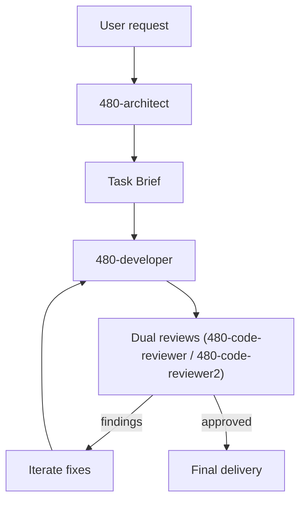

# 480 agents

> Internal use only: this repository is currently intended for Imweb employees.

Install the five 480 agents into OpenCode, Claude Code, and Codex CLI to get a development agent set optimized for the plan -> implement -> review loop.

## What are the 480 agents?

- Development agents optimized for the plan -> implement -> review loop
- https://5k.gg/480ai

## Providers

- OpenCode: user-scope install, with `480-architect` enabled by default and optional desktop notifications through a local plugin hook
- Claude Code: user/project-scope install, with `480-architect` enabled when selected. The installer asks about the agent teams experimental flag and desktop notifications, then writes it into `settings.json` and its `env` block when the flag is enabled.
- Codex CLI: user/project-scope install. The root `AGENTS.md` 480ai managed block provides the architect main prompt, and the custom agent set contains only the four subagents. That root managed block is root-session-only, and spawned custom agents explicitly ignore those architect-only rules in favor of their own child-role instructions. Review runs are normally parallel with `480-code-reviewer` and `480-code-reviewer2`. The delegation budget stays narrow (depth 1 only), and the architect is responsible for explicit child thread closure. Install merges `features.multi_agent = true`, `agents.max_depth = 1`, `agents.max_threads = 200`, and optional desktop notifications into `config.toml`. `python3 -m app.manage_agents verify --target codex --scope user` reports install health and runs a `codex exec --json` diagnostic that validates subagent spawning, waiting, explicit closure, and model inheritance using the local Codex state database.

## Install

```bash
sh -c "$(curl -fsSL https://raw.githubusercontent.com/480/ai/main/bootstrap/install-remote.sh)"
```

This opens a TUI that lets you select multiple providers together.

## Uninstall

```bash
curl -fsSL "https://raw.githubusercontent.com/480/ai/main/bootstrap/uninstall-remote.sh" | sh
```

## License

MIT

## Architecture

The 480 agent workflow follows a short, explicit loop:



The flow keeps scope tight: each task is implemented by `480-developer`, reviewed by two reviewers, and repeated only when findings appear.
