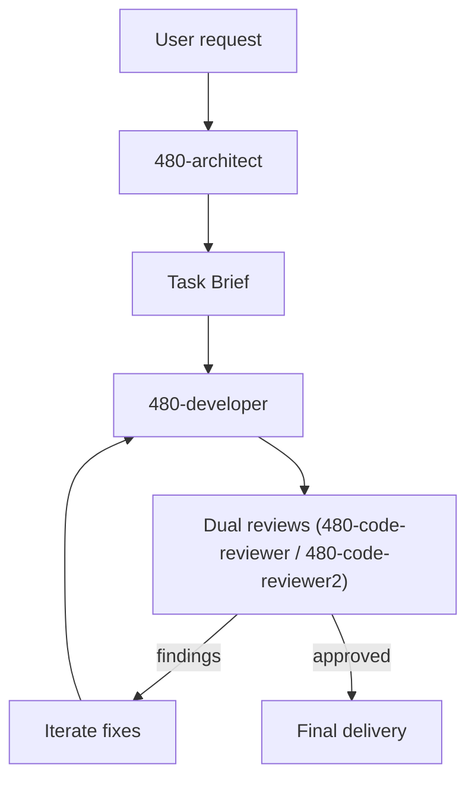

# 480 agents

> Internal use only: this repository is currently intended for Imweb employees.

Install the five 480 agents into OpenCode, Claude Code, and Codex CLI to get a development agent set optimized for the plan -> implement -> review loop.

## What are the 480 agents?

- Development agents optimized for the plan -> implement -> review loop
- https://5k.gg/480ai

## Providers

- OpenCode: User-scope install; enables `480-architect` by default, desktop notifications optional.
- Claude Code: User/project-scope install; `480-architect` optional, and installer prompts to set the experimental agent teams + desktop notification flags in `settings.json`.
- Codex CLI: User/project-scope install; root `AGENTS.md` 480ai block provides architect + 4 subagents, review is `480-code-reviewer` + `480-code-reviewer2`, and install writes `features.multi_agent`, `agents.max_depth`, `agents.max_threads` plus optional desktop notifications to `config.toml`.

## Install

```bash
sh -c "$(curl -fsSL https://raw.githubusercontent.com/480/ai/main/bootstrap/install-remote.sh)"
```

This opens a TUI that lets you select multiple providers together.

## Uninstall

```bash
curl -fsSL "https://raw.githubusercontent.com/480/ai/main/bootstrap/uninstall-remote.sh" | sh
```

## License

MIT

## Architecture

The 480 agent workflow follows a short, explicit loop:



The flow keeps scope tight: each task is implemented by `480-developer`, reviewed by two reviewers, and repeated only when findings appear.
