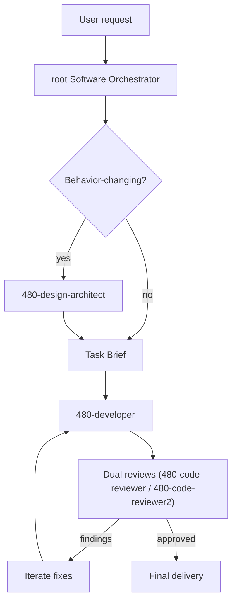

# FEZ (480, Four-Eight-Zero) agents

> Internal use only: this repository is currently intended for Imweb employees.

Install the five FEZ (480, Four-Eight-Zero) agents into OpenCode, Claude Code, Codex CLI, Qwen Code, and Gemini CLI to get a development agent set optimized for the plan -> implement -> review loop.

## What are the FEZ (480, Four-Eight-Zero) agents?

- Development agents optimized for the plan -> implement -> review loop
- https://5k.gg/480ai

## Providers

- OpenCode: user-scope install; enables `480-architect` by default, desktop notifications optional.
- Claude Code: user/project-scope install; `480-architect` optional, and the installer asks whether to merge the experimental agent teams + desktop notification flags into the `env` section of `settings.json`.
- Codex CLI: user/project-scope install; root `AGENTS.md` 480ai block provides a Software Orchestrator plus `480-design-architect` and 4 execution/review/scanner subagents, review is `480-code-reviewer` + `480-code-reviewer2`, install writes `features.multi_agent`, `agents.max_depth = 1`, `agents.max_threads = 200` plus optional desktop notifications to `config.toml`, and Codex user scope defaults to `~/.codex` but can target an alternate root such as `~/.codex-harness` with `--codex-user-root` or `BOOTSTRAP_CODEX_USER_ROOT`.
- Qwen Code: user/project-scope install; uses YAML frontmatter + Markdown body subagent format, copies agents to `~/.qwen/agents/` or `<project>/.qwen/agents/`, `480-architect` optional via `default_agent` setting. Minimum supported Qwen Code version: `>=0.14.0`. Verify you are running the expected binary/version with `type -a qwen` and `qwen --version` (PATH confusion can show an old `0.0.x`).
- Gemini CLI: user/project-scope install; uses YAML frontmatter + Markdown body subagent format, copies agents to `~/.gemini/agents/` or `<project>/.gemini/agents/`, and ensures `{"experimental": {"enableAgents": true, "enableSubagents": true}}` in `settings.json` for compatibility across Gemini CLI versions.

## Install

```bash
sh -c "$(curl -fsSL https://raw.githubusercontent.com/480/ai/main/bootstrap/install-remote.sh)"
```

This opens a TUI that lets you select multiple providers together.
For Codex user scope, interactive install accepts an optional custom user root. An empty root input keeps the default `~/.codex` target, and alternate-root installs isolate managed artifacts only; they do not switch the active Codex runtime profile.

## Uninstall

```bash
curl -fsSL "https://raw.githubusercontent.com/480/ai/main/bootstrap/uninstall-remote.sh" | sh
```

Codex uninstall and verify accept the same optional `--codex-user-root` / `BOOTSTRAP_CODEX_USER_ROOT` override when you need to operate on an alternate user root instead of `~/.codex`.

## License

MIT

## Architecture

The FEZ (480, Four-Eight-Zero) agent workflow follows a short, explicit loop:


```mermaid
flowchart TB
  U["User request"] --> A["root Software Orchestrator"]
  A --> C{"Behavior-changing?"}
  C -->|yes| DA["480-design-architect"]
  C -->|no| TB["Task Brief"]
  DA --> TB
  TB --> D["480-developer"]
  D --> R["Dual reviews (480-code-reviewer / 480-code-reviewer2)"]
  R -->|findings| I["Iterate fixes"]
  R -->|approved| F["Final delivery"]
  I --> D
```

The flow keeps scope tight: each task is implemented by `480-developer`, reviewed by two reviewers, and repeated only when findings appear.
